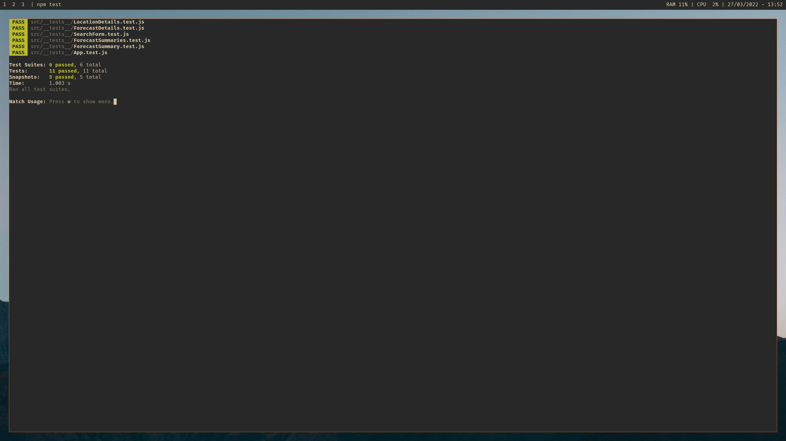
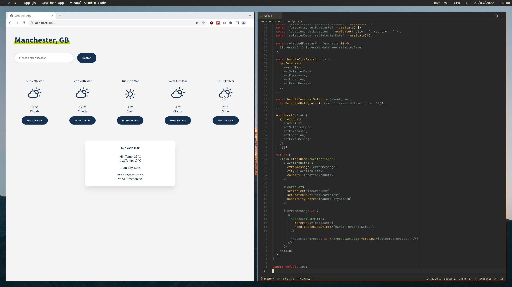

# MCR Codes Weather App

This is my weather app project for [Manchester Codes](https://www.manchestercodes.com) as part of the Frontend module.

## Description

The main purpose of this project is to:

* Learn the fundamentals of the React library.
* Learn how to test components using BDD with the React Testing Library.
* Understand what 'state' is in React.
* Understand what life cycle methods / hooks are in React.

## Features

Using this weather app, you are able to search for the weather in a given location, if the location doesn't exist then an error will be thrown.

## Getting Started

* Clone this repo
  * e.g. `git clone git@github.com:invertostew/weather-app.git`
* Change directory into the repo
  * e.g. `cd weather-app` (or the directory you specified the repo to be cloned into)
* Install the dependencies from `package-lock.json`
  * `npm install`
* To start the app:
  * `npm start`
* To test the app:
  * `npm test`

## Testing

This weather application project was built using a BDD approach. Building the components first, and then later testing to ensure each component meets the acceptance criteria.

All tests are located inside of the `./src/__tests__` directory.

If you wish to run the tests for yourself, you can run `npm install` to install the dependencies, followed by `npm test` to run the tests.

## App Screenshots

This app was built with a mobile first approach.

;
